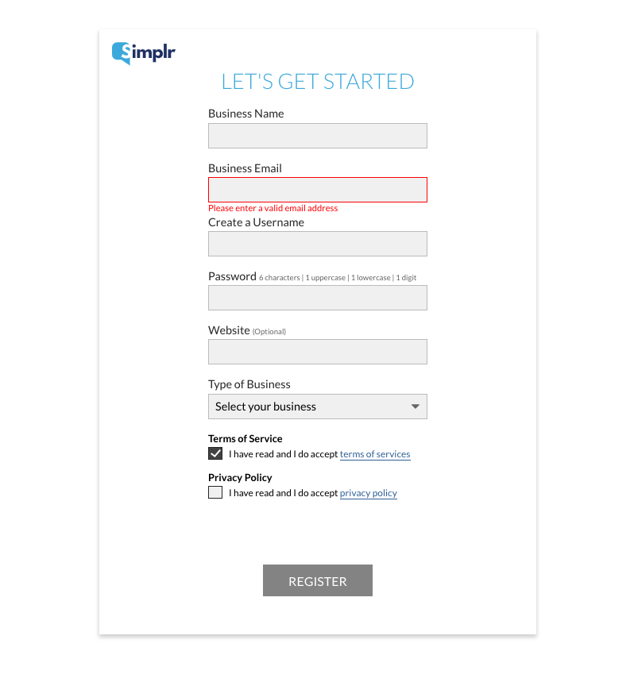
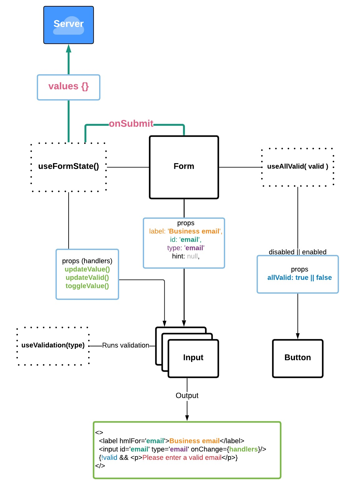

## Simplr form 

<a href='https://formprops-j1vjzi1v7.now.sh'>LIVE DEMO</a>

I made 2 versions of the exercise: 
- data passed using props only (this page)
- with global state using Context API (redux analog) <a href='https://github.com/aleckan53/simplr_form_context'>REPO</a>

### Screenshot


### Data flow



The following set of props passed to create a new Input: 
- `label:String` - Label for input<br/>
- `type:String` - Input type (text || email || password || checkbox)<br/>
- `hint:String` - Hint inside `<label/>`<br/>
- `id:String` - Identifier for `<input id={id}/>`, `<label htmlFor={id}/>`, validation function `validate[id]()`

--

- `useAllValid` - Checks if all inputs are valid. Returns `allValid:Boolean` which disables/enables submit button.
- `useFormState` keeps state of all inputs values and validation status. Returns `values:Object`, `valid:Object`, `handlers:Object`

`handlers` object has 3 methods to manipulate `FormState`:
- `updateValue(id, val)` - passed to inputs as onChange handler, updates values state
- `updateValid(field, isValid)` - passed to inputs as onChange handler updates validation status
- `toggleValue(id)` - passed to checkboxes, handles onChange

--

On submit all values are logged to the console (sent to the server).

### Validation
`useValidation` hook in `Input` component handles validation. It returns: 
- `isValid:Boolean` - current input's validation status
- `msg:String` - validation hint
- `checkValidation:Function` - function that takes `id` and `value` of the current input. `id` is used to call the right validation function from validation util <a href='https://github.com/aleckan53/simplr_form_props/blob/master/src/utils/validation.js'>validation.js</a>

`RegEx.test()` used to validate following values `businessName, email, password, username`.
For `password` value, function returns custom validation message according to the requirements.
- aaaaaa => Password should have one uppercase
- aaaaaA => Password should have one digit
- AAAAA1 => Password should have on lowercase
- aaa => Password should have six characters<

Validation functions names correspond to input's `id`.

### Folders structure
```
src /
|
|_____components /
|    |___Component.js
|_____css /
|    |___index.scss
|    |___index.css
|    |___index.css.map
|    |___components /
|    |  |___Component.scss
|    |___partials / 
|       |___mixins.scss
|       |___variables.scss
|       |___base.scss
|_____hooks /
|    |___useHook.js
|_____utils /
|    |___util.js
|_____tests /
     |___Component.test.js
```

### Styles - SASS

Every component has its own `.scss` file. 
`@mixins` used for styles reuse, reducing repeating properties. 
`$variables` used for colors.
All files then imported to `index.scss` which compiles to `index.css`. 

Compiler - <a href='https://marketplace.visualstudio.com/items?itemName=ritwickdey.live-sass'>VSCode Sass live server extension</a>

##### Responsive layout | Mobile-first approach

`@media` queries used to achieve responsive layout. 

For hi-res screens compatibility `@media` reassigns font-size value at root `html` element at `2400px and 3800px`


### Final Notes

- Submit button is initally disabled (background gray). Enables once all fields are valid and changes color to blue (as in the design file).
- Simplr logo on resolutons < 560px is on top of the form (mobiles).
- on resolutions < 560px paddings and margins are different (mobiles).
- on resulutions > 560px form size is fixed to match design file.
- using div wrappers is avoided when possible, `React.Fragment` used instead.