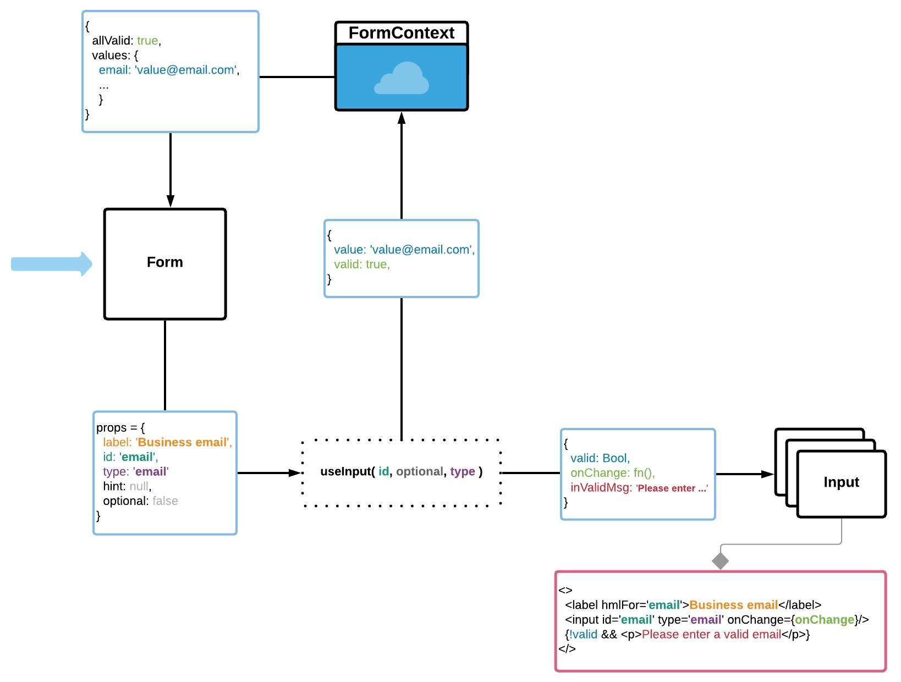

## Simplr form

<a href='https://form-ehhlo2y3h.now.sh'>LIVE DEMO</a>


### Data flow

React Context is used for global state management.
<div style='font-size: 2rem'>...</div>
The following set of props may be passed to create new Input: 

`label:String` - Label for input<br/>
`type:String` - Input type (text || email || password || checkbox)<br/>
`hint:String` - Hint inside `<label/>`<br/>
`optional:Boolean` - If passed, validation skipped<br/>
`id:String` - Identifier for `<input id={id}/>`, `<label htmlFor={id}/>`, validation function `validate[id]()`
<div style='font-size: 2rem'>...</div>

`Input` instantiates `useInput` hook, which handles value updates and validation. `useInput` hook returns `onChange, valid, invalidMsg`. 

• `valid:Boolean` - current input's value validation status<br/>
• `inValidMsg` - conditionally renders red message below the input if `valid === false`.<br/>
• `onChange:Function` - updates `Input` state with `e.target.value`. If `type==='checkbox'` toggles state `true | false`
<div style='font-size: 2rem'>...</div>


`useEffect` in `useInput` observes `value` and `valid` changes and updates corresponding `value` and `valid` in `FormContext`. When `value` is empty, resets `value` and `valid` to `null`. This prevents displaying validation message render when input has no value. Runs validation with 700ms delay, to let a user finish typing. Deleay reset on every keypress to prevent timeout bubbling.

<div style='font-size: 2rem'>...</div>

When all inputs (values) are valid, `useEffect` in `FormContext` sets `allValid` state property to true, which enables Submit button (and changes its bg color to blue).
<hr/>

On `Form` submit all values are logged to the console.

### Validation
`RegEx.test()` used to validate following values `businessName, email, password, username`.
For `password` value, function returns custom validation message according to requirements.<br/>
aaaaaa => Password should have one uppercase<br/>
aaaaaA => Password should have one digit<br/>
AAAAA1 => Password should have on lowercase<br/>
aaa => Password should have six characters<br/>

Validation functions names correspond to input's `id`.

### Folders structure
```
src /
|
|_____components /
|    |___Component.js
|
|_____context /
|    |___ContextFile.js
|
|_____css /
|    |___index.scss
|    |___index.css
|    |___index.css.map
|    |___components /
|    |  |___Component.scss
|    |___partials / 
|       |___mixins.scss
|       |___variables.scss
|       |___base.scss
|
|_____hooks /
|    |___useHook.js
|
|_____utils
|    |___util.js
|_____tests
     |___Component.test.js
```

### Styles

This project styled using SASS. 
Every component has its own `.scss` file. 
`@mixins` used for styles reuse, reducing repeating properties. 
`$variables` used for colors.
All files then imported to `index.scss` which compiles to `index.css`. 

##### Responsive layout | Mobile-first approach

`@media` queries used to achieve responsive layout. 

For hi-res screens compatibility `@media` reassigns font-size value at root `html` element at `2400px and 3800px`


### P.S.
There are a couple of things I did differently, that can be easily changed if needed:
- button initial color is gray, once all fields valid it's blue as in design file
- Simplr logo on resolutons < 560px is on top of the form.
- on resolutions < 560px paddings and margins are different
- on resulutions > 560px form size is fixed to match design file.
- using div wrappers is avoided when possible which resulted in more complex css
